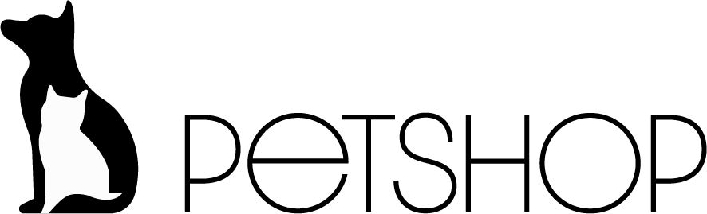

      

<h1 align="center"> Petshop </h1>

    <a href="#demo"> Demonstração</a> •
    <a href="#func"> Funcionalidade</a> •
    <a href="#tec"> Tecnologias</a> •
    <a href="#projeto"> Projeto</a> 
        

<h2 id="demo"> 📷 Demonstração </h2>

<h2 align="center">  </h2>
<h2 align="center">  </h2>
<h2 align="center">  </h2>
<h2 align="center">  </h2>
<h2 align="center">  </h2>

 

<h2 id="func"> ⚙ Funcionalidades </h2>

 - [x] Formulário de contato  
 - [x] Seleção de texto com tema da página 
 - [x] Transparência em imagens de serviços 
 - [x] Botões com direcionamento  
 - [x] Responsividade    

<h2 id="tec"> 🚀 Tecnologias </h2>

 Esse projeto foi desenvolvido com as seguintes tecnologias: 
 

✔️HTML  
✔️CSS  

<h2 id="projeto"> 💻 Projeto </h2>

Esse projeto é um site com temática de petshop voltado a treinar conceitos como formulário, flexbox, links, e afins, além da criação do layout de forma simples e intuitivo.
 
 

 

 Criado por Lucas Freitas | <a href="https://www.linkedin.com/in/lucasfreitas01/"> Faça contato comigo </a> 
 
